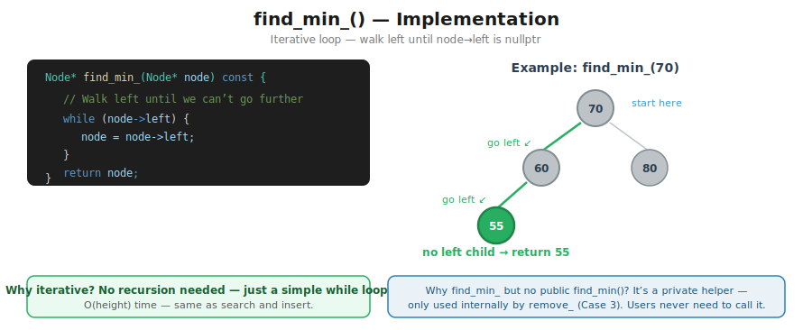
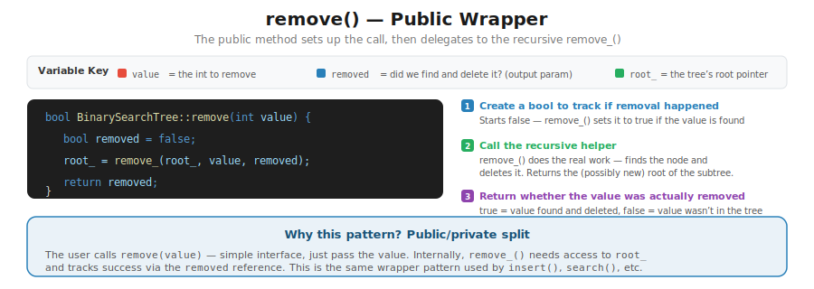
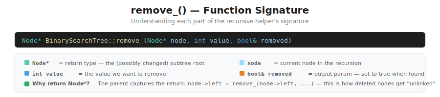
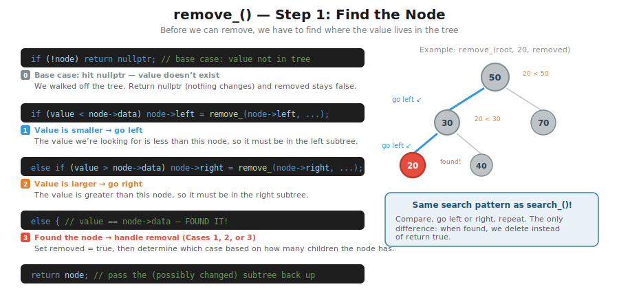
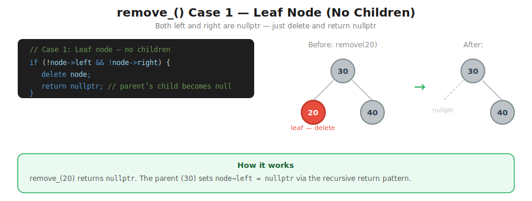
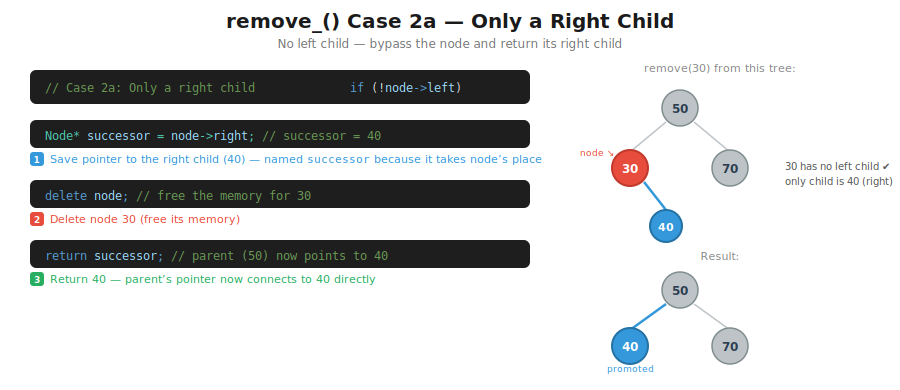
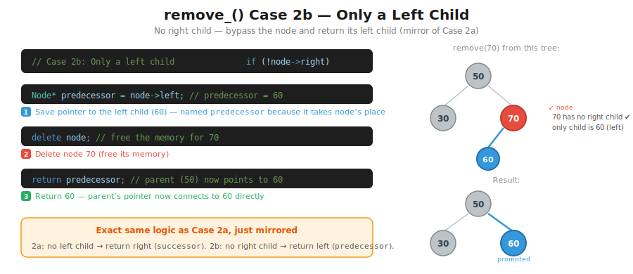
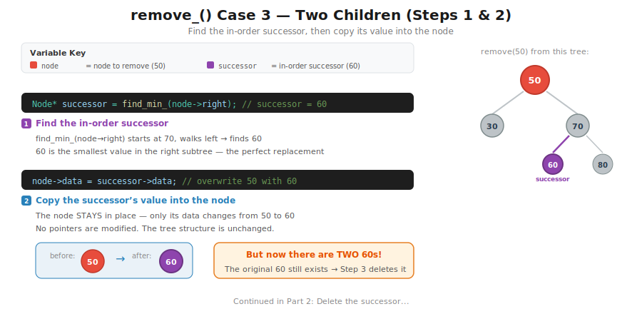
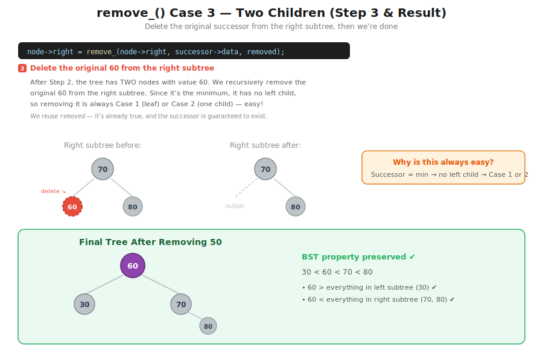

# CT16 -- Implementation Diagrams

Code-block diagrams referenced from `BinarySearchTree.cpp`.

---

## 1. find_min_() Implementation
*`BinarySearchTree.cpp::find_min_()` -- iterative loop walks left until no left child*

---

## 2. remove() -- Public Wrapper
*`BinarySearchTree.cpp::remove()` -- sets up the call, delegates to recursive remove_()*

---

## 3. remove_() -- Function Signature
*`BinarySearchTree.cpp::remove_()` -- what each parameter means and why it returns Node\**

---

## 4. remove_() -- Finding the Node
*`BinarySearchTree.cpp::remove_()` -- recursive search: go left, go right, or found it*

---

## 5. remove_() Case 1 -- Leaf Node
*`BinarySearchTree.cpp::remove_()` -- no children: delete node, return nullptr*

---

## 6. remove_() Case 2a -- Only a Right Child
*`BinarySearchTree.cpp::remove_()` -- no left child: save right child, delete node, return right child*

---

## 7. remove_() Case 2b -- Only a Left Child
*`BinarySearchTree.cpp::remove_()` -- no right child: save left child, delete node, return left child*

---

## 8. remove_() Case 3 -- Two Children (Steps 1 & 2)
*`BinarySearchTree.cpp::remove_()` -- find the in-order successor, copy its value into the node*

---

## 9. remove_() Case 3 -- Two Children (Step 3 & Result)
*`BinarySearchTree.cpp::remove_()` -- delete the original successor, final tree*

