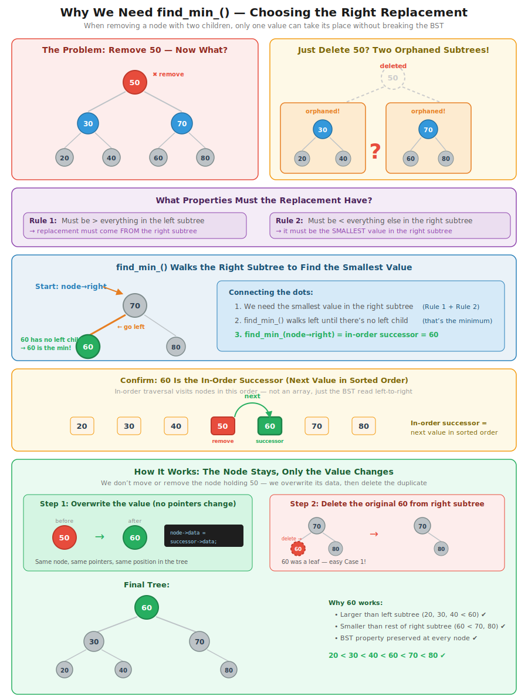
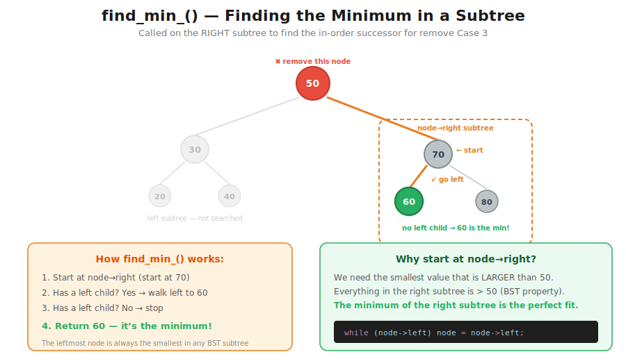

# CT16 -- Header Diagrams

Conceptual diagrams referenced from `BinarySearchTree.h`.

---

## 1. Why We Need find_min_()
*`BinarySearchTree.h::remove_()` -- why the in-order successor is the only valid replacement*

---

## 2. find_min_() Overview
*`BinarySearchTree.h::find_min_()` -- the minimum is always the leftmost node in a subtree*

---

## 3. remove_() -- Three Cases at a Glance
*`BinarySearchTree.h::remove()` -- leaf, one child, or two children determines the strategy*

