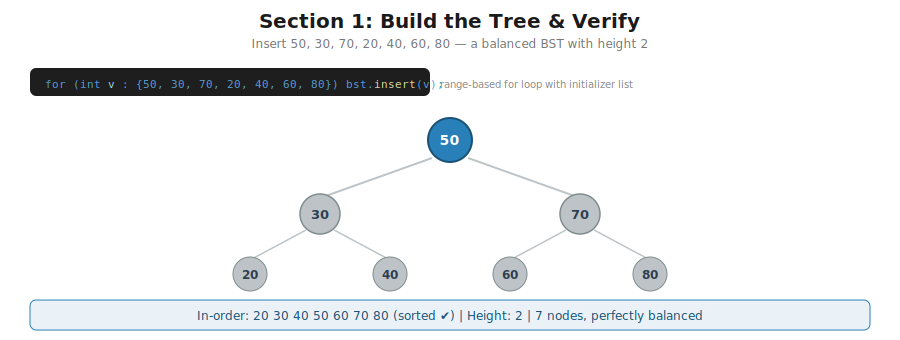
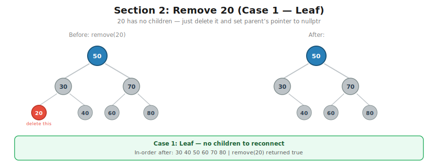
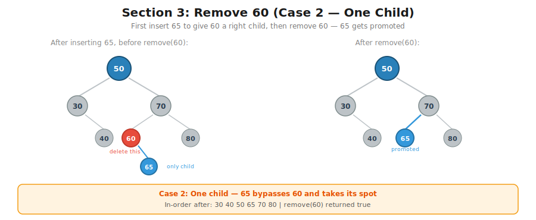
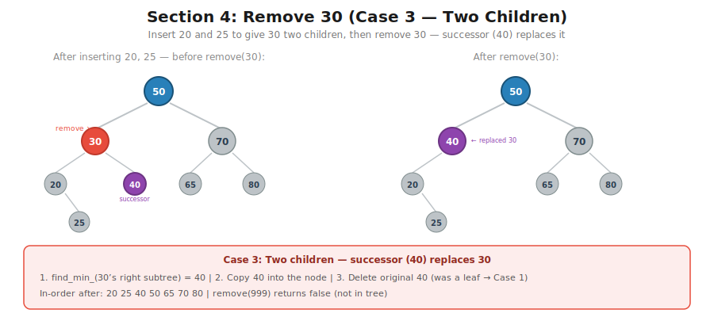
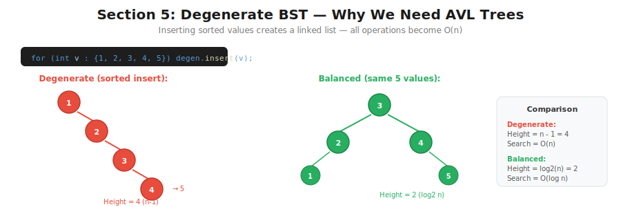

# CT16 -- Main Demo Diagrams

Visual walkthrough of the tree states in `main.cpp`.

---

## 1. Build the Tree
*`main.cpp` Section 1 -- insert 50, 30, 70, 20, 40, 60, 80*

---

## 2. Remove 20 (Case 1 -- Leaf)
*`main.cpp` Section 2 -- 20 has no children, just delete it*

---

## 3. Remove 60 (Case 2 -- One Child)
*`main.cpp` Section 3 -- insert 65, then remove 60 (only child is 65)*

---

## 4. Remove 30 (Case 3 -- Two Children)
*`main.cpp` Section 4 -- insert 20 and 25, then remove 30 (successor is 40)*

---

## 5. Degenerate BST
*`main.cpp` Section 5 -- sorted insertion creates a linked list, motivates AVL trees*

